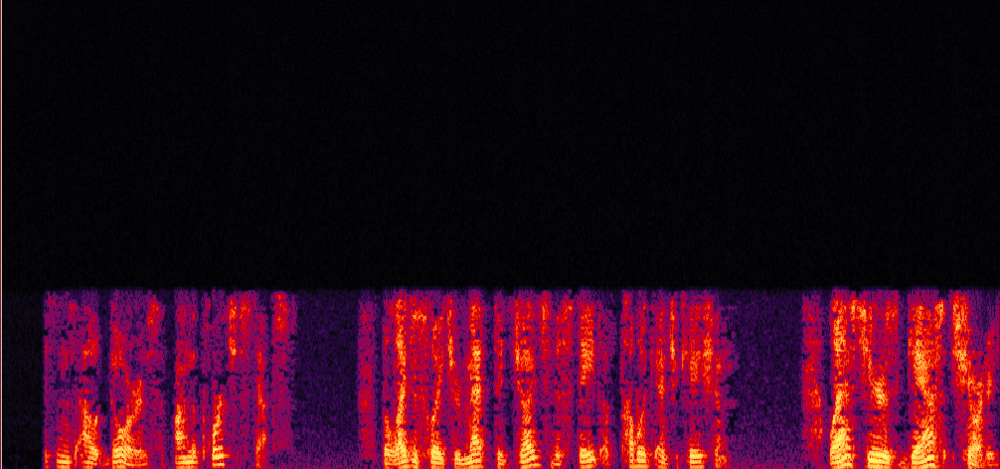
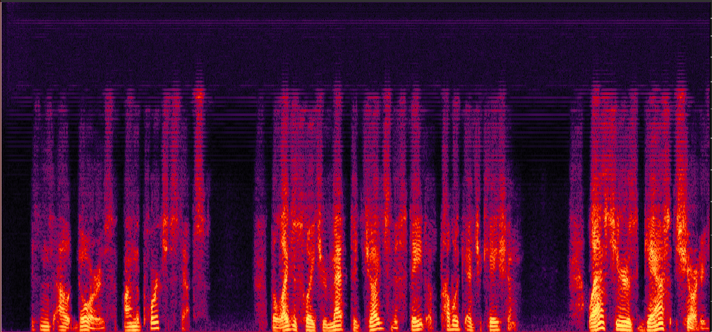

# 
Demo Page for Universal Speech Enhancement

## 
Introduction

Universal speech enhancement is the task of enhancing speech signals that have been recorded in various conditions and distortions, such as noise, reverberation, clipping, EQ distortion, packet loss, codecs loss, bandwidth loss and other distortions.

## 
Samples

### 1. Bandwidth limitation and Codec Distortion

    

        Original
        
        <audio controls style="width: 100%; margin-top: 10px;">
            <source src="audio/bwe_codecs_original.wav" type="audio/wav">
            Your browser does not support the audio element.
        </audio>
    

    

        GAN Enhanced
        
        <audio controls style="width: 100%; margin-top: 10px;">
            <source src="audio/bwe_codecs_GAN.wav" type="audio/wav">
            Your browser does not support the audio element.
        </audio>
    

    

        Storm Enhanced
        
        <audio controls style="width: 100%; margin-top: 10px;">
            <source src="audio/bwe_codecs_Storm.wav" type="audio/wav">
            Your browser does not support the audio element.
        </audio>
    

